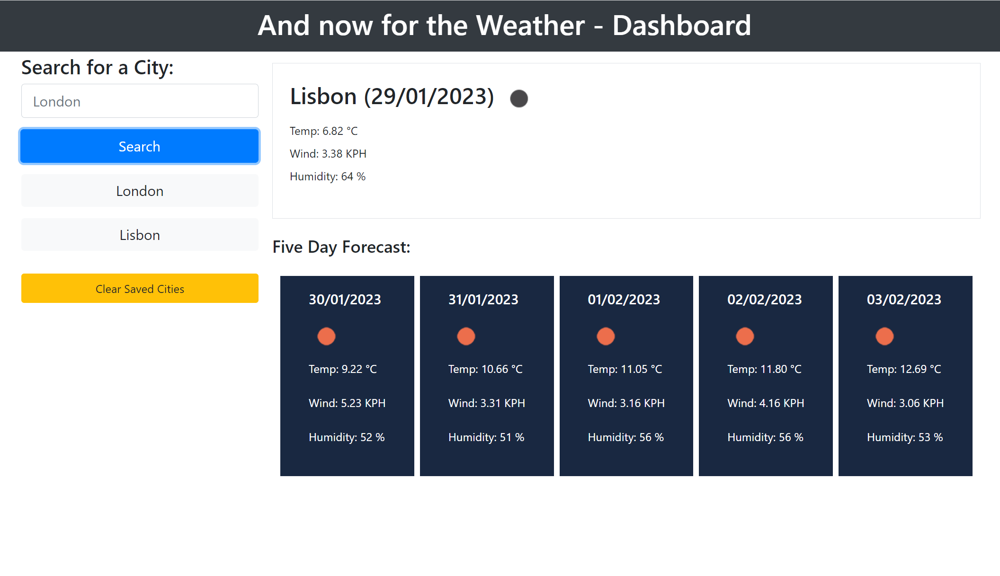

# And now for the Weather - Dashboard!

## Description

- A simple JQuery & Javascript weather app that displays the current weather for a city.
- The user inputs a data using the form provided. Upon clicking or pressing enter on the search form, the dashboard is able to display the current weather for the chosen city and the next 5 day forecast.
- This app uses JQuery methods, AJAX calls, APIs, Javascript, HTML, Bootstrap and the moment.js library.
- The moment library helps identify the day and time, and formats and parses UNIX timestamps. 
- The user can select multiple cities that are saved to local storage.
- Each saved city is appended as a button, which when clicked can make an API call to the OpenWeatherMap API, parsing the JSON data available.
- Upon page reload the data remains on the page. The user can clear saved data using the clear button.

## Installation

N/A

## Usage

Wanna know the weather in Spain? Well input your chosen location and the world of API's will astound you!!!

## Credits

- The Bootcamp lot, looking back over the previous week's lessons
- https://api.jquery.com/
- https://momentjs.com/
- https://getbootstrap.com/

## License

MIT License

## Link

- https://github.com/nattytatat/and-now-for-the-weather

- https://nattytatat.github.io/and-now-for-the-weather